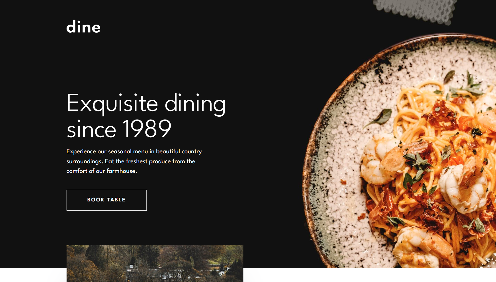
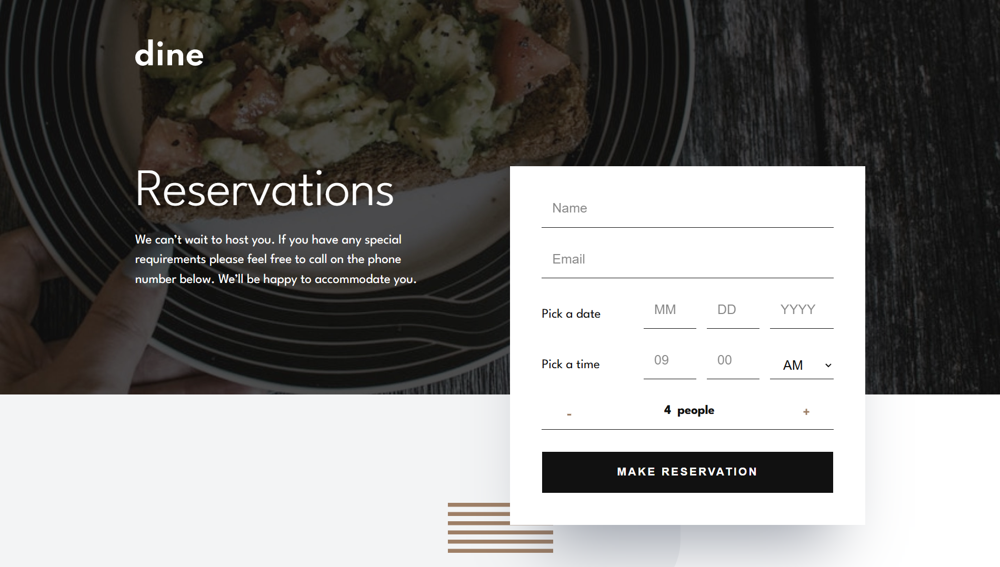

# Frontend Mentor - Dine Website Challenge solution

Це завдання мені дав мій ментор, з яким я займаюсь вже біля місяця. Це був гарний досвід і я почував себе як людина, яка робить повноцінний сайт для компанії. 

## Table of contents

- [Overview](#overview)
  - [The challenge](#the-challenge)
  - [Screenshot](#screenshot)
  - [Links](#links)
- [My process](#my-process)
  - [Built with](#built-with)
  - [What I learned](#what-i-learned)
- [Author](#author)
- [Acknowledgments](#acknowledgments)

## Overview

### The challenge

Users should be able to:

- View the optimal layout for each page depending on their device's screen size
- See hover states for all interactive elements throughout the site
- See the correct content for the Family Gatherings, Special Events, and Social Events section when the user clicks each tab
- Receive an error message when the booking form is submitted if:
  - The `Name` or `Email Address` fields are empty should show "This field is required"
  - The `Email Address` is not formatted correctly should show "Please use a valid email address"
  - Any of the `Pick a date` or `Pick a time` fields are empty should show "This field is incomplete"

### Screenshot



### Links

- Solution URL: [GitHub Repository](https://github.com/des0lt/dine-restaurant)
- Live Site URL: [GitHub Pages](https://des0lt.github.io/dine-restaurant/)

## My process

### Built with

- Semantic HTML5 markup
- CSS custom properties
- Flexbox
- CSS Grid
- Mobile-first workflow

### What I learned

1. Я навчився використовувати псевдо-елементи
```css
&::before {
  content: '';
  position: absolute;
  top: 10px;
  left: 0;
  transform: translateX(-200%);
  width: 31px;
  height: 1px;
  background-color: #9E7F66;
}
```

2. Почав використовувати meta-теги
```html
<meta name="description" content="Main page of restaurant Dine">
```

3. Навчився працювати з CSS Grid
```css
section, header, footer {
    display: grid;
    grid-template-columns: repeat(12, 65px);
    column-gap: 30px;
    justify-content: center;
}
```

4. Навчився робити валідацію форми
```js
inputs.forEach(input => {
    if (input.value.trim() == '') {
        input.classList.add('error-state');
    } else {
        input.classList.remove('error-state')
    }
})
```

5. Навчився робити та реалізовувати README файли

## Author

- GitHub - [des0lt](https://github.com/des0lt)

## Acknowledgments

Хочу подякувати свого ментора Івана за допомогу у цьому проекті. Він завжди допомагав в усіх запитаннях та давав корисні ресурси.
